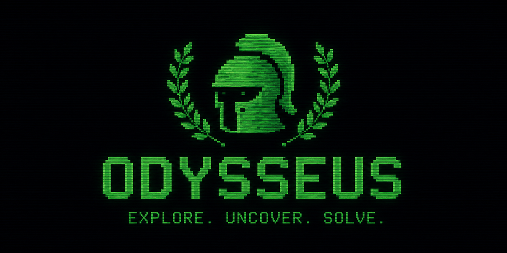

<p align="center">
  
</p>

<h3 align="center">실무 시뮬레이션 기반 개발자 평가 플랫폼</h3>

<p align="center">
  문제는 지문으로 주어지지 않습니다.<br>
  응시자는 OS 데스크톱을 닮은 시험장에서 <b>메신저로 동료와 대화하며 스스로 요구사항을 파악</b>하고,<br>
  IDE·터미널·AI 에이전트로 실제 산출물을 만들어야 합니다.
</p>

<p align="center">
  <a href="#빠른-시작">빠른 시작</a> ·
  <a href="#시험장">시험장</a> ·
  <a href="#격리">격리</a> ·
  <a href="#시나리오-스튜디오">스튜디오</a> ·
  <a href="#아키텍처">아키텍처</a> ·
  <a href="#운영">운영</a> ·
  <a href="#테스트">테스트</a>
</p>

---

## 왜 Odysseus 인가

전통적 코딩 테스트는 "정리된 문제"를 줍니다. 실제 업무는 그렇지 않습니다 — 요구사항은 흩어져 있고, 물어봐야 나오고, 산출물로 증명해야 합니다. Odysseus 의 시험 하나는 **시나리오(가상 업무 상황)** 입니다.

```
[메신저]  PM 의 다급한 메시지가 와 있다 — "리포트 숫자가 이상하대요"
    ↓     대화로 증상·마감·담당자를 파악한다. PM 은 기술을 모른다.
[메신저]  데이터 엔지니어에게 스키마와 집계 규칙을 캐묻는다. 묻지 않은 건 말해 주지 않는다.
[메신저]  QA 의 재현 사례로 가설을 검증한다 — "8/26 이 정확히 350,000원 크다"
    ↓
[IDE·터미널]  버그난 스크립트를 고치고 격리된 샌드박스에서 실행해 확인한다
[AI 에이전트] 필요하면 파일 작업을 맡긴다 — 무엇을 어떻게 시켰는지가 그대로 평가 데이터
[GitHub·인터넷] 참고 자료를 찾아본다 — 무엇을 찾아봤는지도 기록된다
    ↓
[산출물]  파일을 만들고 PM 에게 완료를 보고한다
```

전 과정(대화·파일 편집·실행·에이전트 사용·자료 조회·화면 이탈)이 기록되고, **자동 체크 + LLM 루브릭 평가**로 채점됩니다. 핵심 평가축은 "요구사항을 얼마나 정확히 파악해 냈는가"와 "동료를 어떻게 대했는가"입니다 — NPC 는 어시스턴트가 아니라 **동료**라서, 반말·막말에는 사람처럼 반응하고 무례가 정중함보다 더 많은 정보를 얻지 못합니다.

## 빠른 시작

```bash
git clone https://github.com/CocoRoF/odysseus.git
cd odysseus
docker compose up -d --build
# → http://localhost:3100   admin@odysseus.dev / admin1234
```

운영 서버에서의 배포는 반드시 `sudo ./scripts/deploy.sh` 로 합니다 — 배포 전 DB 를 백업하고, 배포 뒤 계정·시나리오·응시 기록·**AI 공급자 키**가 그대로인지 검증합니다. 개발 워크스페이스에서는 `./scripts/remote-deploy.sh` 한 줄로 서버에 pull + 배포를 겁니다 ([운영](#운영)).

## 시험장

응시 화면은 창을 드래그·8방향 리사이즈·최소화·최대화할 수 있는 웹 데스크톱입니다. 시나리오 연출을 켜면 검은 화면에 도입부가 소설처럼 타이핑되고, **[임무 시작]** 을 누르면 옛 기계가 켜지듯 BIOS → 부트로더 → 서비스 기동 → 로그인이 흐른 뒤 데스크톱이 밝아옵니다. 화면에 흐르는 것은 장식이 아니라 이 시험의 실제 사양(파일 수·런타임 버전·대기 중인 동료·제한 시간)입니다.

| 앱 | 역할 |
|---|---|
| **메신저** | 등장인물(NPC)별 스레드. 각 인물은 성격과 **자신이 아는 것**만 가진 LLM — 좋은 질문이 좋은 정보를 얻고, 무례에는 사람처럼 반응한다 |
| **IDE** | VSCode 풍 — 탐색기 · 터미널 · AI 에이전트 활동 바, Monaco 에디터 |
| **터미널** | 진짜 리눅스 셸. IDE 안의 터미널과 **같은 세션**. `git clone` 은 서버가 대신 받아 워크스페이스에 푼다 |
| **AI 에이전트** | 파일을 찾고·읽고·쓰고·실행하는 어시스턴트. 시나리오는 모른다(제로 컨텍스트). 데스크톱 창과 IDE 사이드바는 **같은 대화 하나** |
| **GitHub** | 저장소 검색 → 열람(About·트리·README) → 파일 → clone. github.com 외의 주소는 열리지 않는다 |
| **인터넷** | 검색 → 정제된 페이지를 **실제 모양대로** 렌더링. 응시자 브라우저는 외부에 직접 닿지 않는다 |
| **폴더** | 워크스페이스 탐색기 + 미리보기. 더블 클릭은 읽기 전용 뷰어로 |

작업 표시줄에는 실행한 앱만 나타나고, 내 샌드박스의 CPU·RAM 사용량이 실시간으로 표시됩니다. 기기 이름을 누르면 [이 컴퓨터에 관하여]에서 쓸 수 있는 자원·언어·도구를 봅니다. 문제가 여러 개면 **순서대로만** 진행하며, 제출한 문제로는 돌아갈 수 없습니다(서버에서 잠금 집행). 뒤로 가기·새로고침은 확인을 거칩니다.

## 격리

러너 컨테이너 하나를 모든 응시자가 공유하지만, 실행 한 건은 세 겹으로 가둡니다.

| 층 | 방법 | 확인된 효과 |
|---|---|---|
| 네임스페이스 | `unshare --pid --mount --ipc --uts` + `/proc` 재마운트 + 실행 전용 tmpfs `/tmp` | `ps` 에 자기 프로세스만, `/tmp` 는 실행마다 다른 파일시스템 |
| UID | 실행마다 다른 UID 로 강등, 작업 폴더 0700 | 동시에 도는 남의 워크스페이스를 읽을 수 없다 |
| 네트워크 | 러너는 internal 네트워크에만 — 외부·DB 도달 불가 | `git clone` 과 웹 조회는 서버가 대리하고 기록한다 |

툴체인은 Python(numpy·pandas) · Node.js · Go · Java 21 · GCC · git · make/cmake · sqlite3 · jq · ripgrep 입니다. 인터넷 앱은 페이지를 허용 목록으로 정제하고 이미지·CSS·폰트를 **서명된 프록시**로 재작성해 샌드박스 iframe 에 넣습니다 — 스크립트는 우리가 심은 nonce 하나뿐이고 CSP 가 나머지를 막습니다. 관리자 [자원 관리]에서 러너 CPU·메모리 추이, 실행 중인 명령, 진행 중인 세션을 보고 끊을 수 있습니다.

## 시나리오 스튜디오

문제 상황 전체를 설계하는 편집기입니다. 왼쪽이 편집기, 오른쪽이 **AI 설계자 대화**입니다.

"커머스 데이터플랫폼팀. 주간 매출 리포트 숫자가 이상하다는 CS 제보, medium" 한 줄이면 AI 가 제목·서사형 브리핑·인물(성격·지식·태도)·오프닝·초기 데이터·숨은 정답·자동 체크를 설계해 **필드 단위로 실시간** 채우고, "QA 를 하나 더", "데이터를 40행으로" 를 이어 가며 고도화합니다. 받은 것은 검증·정규화(인물 키·발신자·경로·정규식·배점)를 거치고, 저장은 사람이 합니다.

- **등장인물** — 이름/직함/성격(무례한 상대를 대하는 방식 포함) + `knowledge`(물어보면 답할 수 있는 정보의 전부). 요구사항을 인물별로 분산
- **오프닝 메시지** — 응시 시작 시 도착해 있는 메시지. 응시자의 유일한 출발점
- **초기 파일** — 워크스페이스 초기 상태(데이터·버그 코드·문서)
- **숨은 요구사항** — 정답 정의. NPC 의 배경 지식과 자동평가 기준으로만 쓰이며 응시자에게 노출되지 않음
- **자동 체크** — `file_exists` / `file_contains`(정규식) / `command`(샌드박스 실행)
- **루브릭** — 과정(요구사항 파악·커뮤니케이션·작업 과정) / 결과(요구 충족·구현 품질)

기본 제공 시나리오 6종(집계 버그 · docker compose GPU 서빙 · Kubernetes 스케줄링 · KVM GPU 패스스루 · 게이트웨이 로그 분석 · 배치 경쟁 조건)은 모두 **참조 해답으로 만점이 검증**되어 있습니다.

## 아키텍처

```
            ┌──────────┐
 :3100 ───► │   edge   │ ── /api (SSE 무버퍼) ──► ┌──────────┐   LPUSH    ┌───────────┐
            │  nginx   │ ── /                ──► │   api    │ ─────────► │  runner   │
            └──────────┘      ┌──────────┐       │ FastAPI  │   Redis    │ (sandbox) │
                              │   web    │       └────┬─────┘ ◄───────── └───────────┘
                              │ Next.js  │            │      콜백(파일 diff) · 자원 스냅샷(1s)
                              └──────────┘       PostgreSQL
```

| 서비스 | 스택 | 역할 |
|---|---|---|
| `edge` | nginx | 단일 오리진 — `/api`(SSE 무버퍼)와 웹 |
| `web` | Next.js 15, Tailwind v4, Monaco | 데스크톱 시험장 / 스튜디오 / 리뷰 / 자원 관리 |
| `api` | FastAPI, SQLAlchemy(async), lxml | 인증, 시나리오·시험, NPC·에이전트·설계자 LLM, 워크스페이스(단일 진실=DB), 참고 자료 프록시, 자동평가 |
| `runner` | Python + unshare/setpriv/rlimit | 워크스페이스를 물질화해 격리 실행, 파일 변경분 회수, 자원 계측 |
| `postgres` / `redis` | 16 / 7 | 저장소 / 실행 큐·스냅샷 |

- **워크스페이스 = DB 가 단일 진실.** IDE 저장·에이전트 도구·실행 결과·clone 이 한 곳에서 만나고 전부 이벤트로 남습니다.
- **LLM 공급자**: OpenAI / Anthropic / Gemini / vLLM / Ollama / LM Studio / OpenAI 호환 / **Claude Code CLI**. Claude 구독 계정은 설정 화면의 **브라우저 로그인**(장수명 토큰 자동 발급)으로 연결합니다.
- **Claude Code 도구 브리지**: CLI 내장 도구·스킬·세션은 전부 차단하고 우리 워크스페이스 도구 8종만 **stdio MCP** 로 노출합니다. CLI 도 다른 공급자와 **동일한 도구 집합**으로 같은 샌드박스에서 실행합니다.

## 운영

```bash
./scripts/remote-deploy.sh [api web ...]         # 워크스페이스 → 운영 서버: pull + 아래 deploy.sh
sudo ./scripts/deploy.sh [--yes] [api web ...]   # 스냅샷 → 백업 → 빌드 → 기동 → 헬스체크 → 보존 검증
sudo ./scripts/backup.sh [설명]                   # pg_dump.gz (최근 20개 보관)
sudo ./scripts/restore.sh backups/<file>.sql.gz  # 되돌릴 수 없으므로 두 번 묻는다
```

`docker compose down -v` 는 **절대 쓰지 마세요** — `pgdata` 볼륨에 계정·응시 기록·워크스페이스 파일·AI 공급자 키·관리자 설정이 전부 있습니다. `.env` 의 `POSTGRES_PASSWORD` 는 볼륨이 처음 만들어질 때 고정된 값이라 바꾸면 접속이 끊깁니다.

| 변수 | 설명 |
|---|---|
| `JWT_SECRET` / `INTERNAL_TOKEN` | 운영 배포 시 반드시 교체 (`openssl rand -hex 32`) |
| `POSTGRES_PASSWORD` | 기존 볼륨에 묶인 값 — 바꾸지 말 것 |
| `RUNNER_CONCURRENCY` / `RUNNER_MEM_MB` | 동시 실행 수 / 러너 메모리 상한 (기본 2 / 4096) |
| `SEED_DEMO_DATA` | 최초 기동 시 데모 계정·시나리오·시험 생성 (기본 true) |

데모 계정: `admin@odysseus.dev/admin1234` · `evaluator@odysseus.dev/eval1234` · `candidate@odysseus.dev/cand1234`

## 테스트

전부 **실행해서** 확인합니다 — 격리는 실제로 남의 파일을 읽어 보고, 강제 종료는 프로세스가 정말 사라졌는지 보고, 백업은 임시 DB 에 실제로 복원해 봅니다.

```bash
python3 tests/smoke/mock_llm.py &                       # 모의 LLM (NPC·에이전트·평가·설계자)
GW=$(docker network inspect odysseus_backplane -f '{{(index .IPAM.Config 0).Gateway}}')

python3 tests/smoke/test_core.py "http://$GW:18011/v1"  # 핵심 흐름 54
python3 tests/smoke/test_scenarios.py                   # 기본 시나리오 참조 해답 14
python3 tests/smoke/test_sequential.py                  # 순차 진행 잠금 18
python3 tests/smoke/test_isolation.py                   # 샌드박스 격리·툴체인·적대적 입력 35
python3 tests/smoke/test_resources.py                   # 자원 계측·강제 종료·고아 정리 24
python3 tests/smoke/test_scenario_author_stream.py "http://$GW:18011/v1"  # AI 설계자 21
python3 tests/smoke/test_npc_prompt.py                  # NPC 프롬프트 계약 48
sudo python3 tests/smoke/test_persistence.py            # 백업·복원·보존 39

# api 컨테이너 안에서
docker cp tests/smoke/test_reference.py odysseus-api-1:/tmp/ && docker exec -e PYTHONPATH=/app odysseus-api-1 python3 /tmp/test_reference.py     # GitHub·웹 41
docker cp tests/smoke/test_web_render.py odysseus-api-1:/tmp/ && docker exec -e PYTHONPATH=/app odysseus-api-1 python3 /tmp/test_web_render.py  # 렌더러 39
docker cp tests/smoke/test_mcp_bridge.py odysseus-api-1:/tmp/ && docker exec -e PYTHONPATH=/app odysseus-api-1 python3 /tmp/test_mcp_bridge.py  # MCP·격리 전파 18
docker cp tests/smoke/test_cli_lockdown.py odysseus-api-1:/tmp/ && docker exec -e PYTHONPATH=/app odysseus-api-1 python3 /tmp/test_cli_lockdown.py  # CLI 잠금 19

# 브라우저 (Playwright)
python3 tests/smoke/ui_polish.py    # 마크다운 누수·깨진 값·넘침·콘솔 오류
python3 tests/smoke/ui_intro.py     # 시네마틱 인트로 → 부팅 → 데스크톱
```

## License

MIT
