<p align="center">
  
</p>

<p align="center"><b>문제는 지문으로 주어지지 않습니다.</b></p>

<p align="center">
  Odysseus 는 실무 시뮬레이션으로 개발자를 평가합니다.<br>
  응시자는 OS 데스크톱을 닮은 시험장에 출근해, 메신저로 동료와 대화하며 무엇을 해야 하는지 스스로 알아내고,<br>
  IDE·터미널·AI 에이전트로 실제 산출물을 만듭니다. 그 모든 과정이 평가가 됩니다.
</p>

<p align="center">
  <a href="#한-번의-시험">한 번의 시험</a> ·
  <a href="#시험장">시험장</a> ·
  <a href="#동료들">동료들</a> ·
  <a href="#설계자를-위한-도구">설계자를 위한 도구</a> ·
  <a href="#신뢰할-수-있는-환경">신뢰할 수 있는 환경</a> ·
  <a href="#시작하기">시작하기</a>
</p>

<br>

## 왜 시뮬레이션인가

코딩 테스트는 잘 정리된 문제를 줍니다. 실제 업무는 그렇지 않습니다. 요구사항은 여러 사람에게 흩어져 있고, 물어봐야 나오고, 어떤 것은 틀린 채로 전해지며, 결국 산출물로 증명해야 합니다.

Odysseus 의 시험 하나는 **상황**입니다. 출근한 첫날, 누군가의 다급한 메시지에서 시작해, 누구에게 무엇을 물어야 하는지 판단하고, 확인하고, 만들어 내는 과정 전체를 봅니다. 채점의 중심은 "요구사항을 얼마나 정확히 파악해 냈는가" 그리고 "동료를 어떻게 대했는가"입니다.

<br>

## 한 번의 시험

시험은 소설의 도입부처럼 시작합니다. 언제, 어디서, 당신은 누구이며, 방금 무슨 일이 벌어졌는지. 무엇을 해야 하는지는 적혀 있지 않습니다.

<p align="center">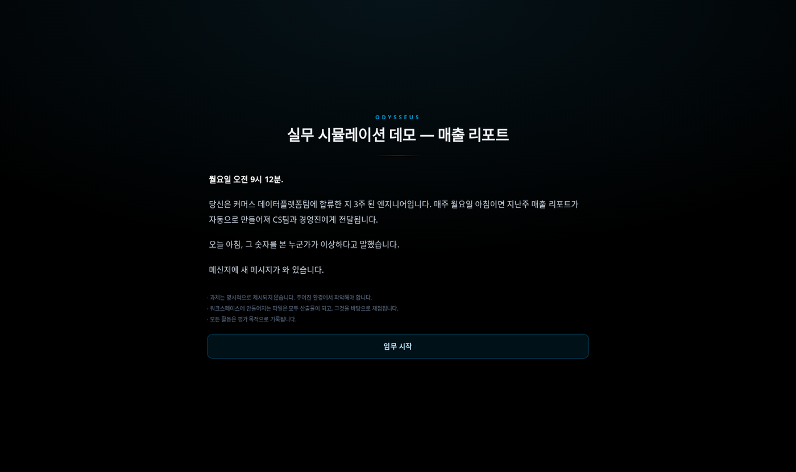</p>

**임무 시작**을 누르면 워크스테이션이 켜집니다. 화면에 흐르는 것은 연출이 아니라 이 시험의 실제 사양입니다 — 워크스페이스의 파일 수, 설치된 언어의 버전, 메신저에 대기 중인 동료들, 제한 시간.

<p align="center">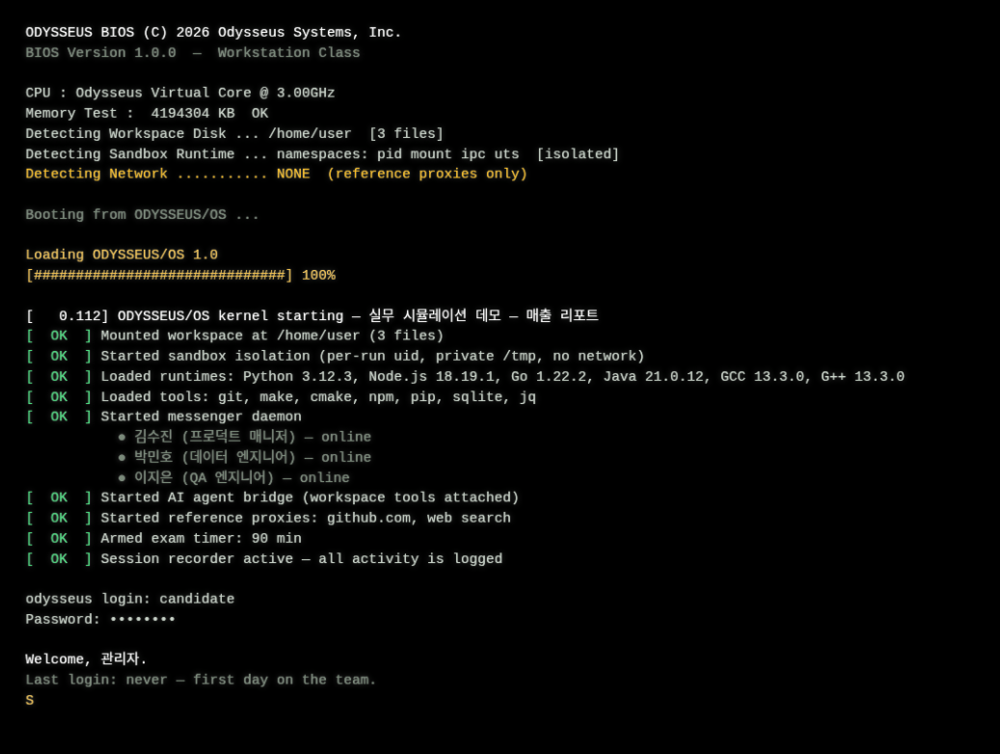</p>

데스크톱이 밝아오면 메신저에 메시지가 와 있습니다. 기술을 모르는 PM 의 막연한 부탁입니다. 여기서부터는 응시자의 몫입니다.

<p align="center">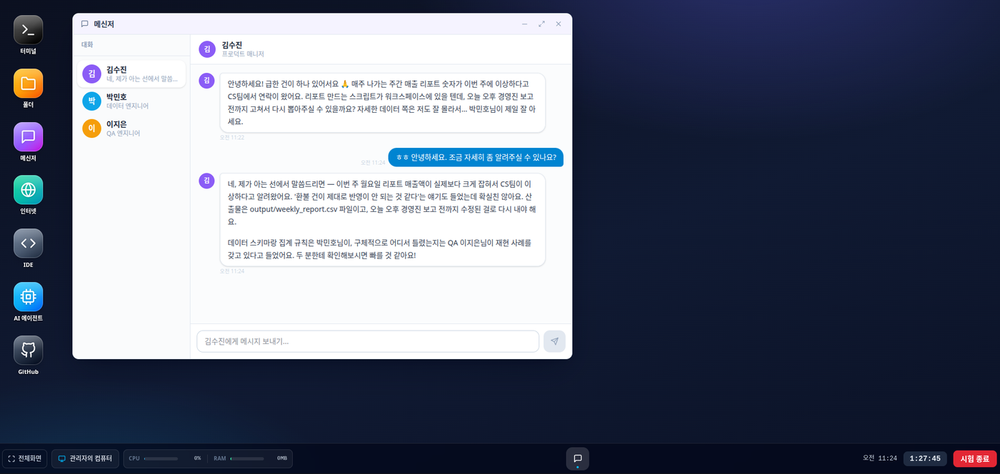</p>

동료에게 캐물어 스키마와 규칙을 알아내고, QA 의 재현 사례로 가설을 확인하고, IDE 에서 스크립트를 고치고, 터미널에서 실행해 봅니다. 필요하면 AI 에이전트에게 파일 작업을 맡깁니다 — 무엇을 어떻게 시켰는지도 그대로 기록됩니다.

<p align="center">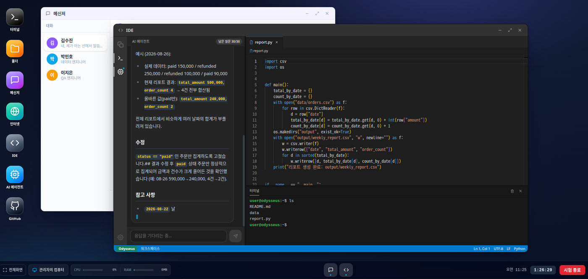</p>

산출물이 준비되면 제출합니다. 제출한 문제로는 돌아갈 수 없습니다.

<p align="center">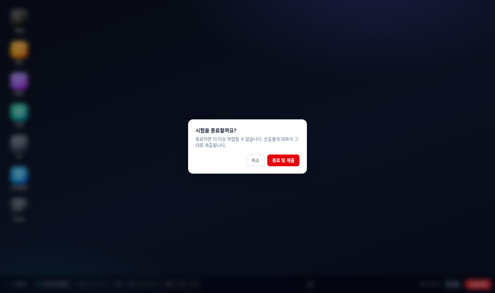</p>

<br>

## 시험장

응시자에게 주어지는 것은 창을 옮기고 늘리고 겹칠 수 있는 하나의 데스크톱입니다. 일곱 개의 앱이 있습니다.

<p align="center">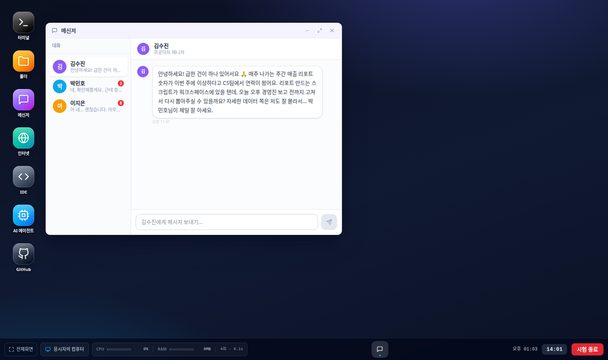</p>

| | |
|---|---|
| **메신저** | 등장인물별 대화. 각 인물은 자기 성격과 자기가 아는 것만 가진 동료입니다. |
| **IDE** | 탐색기·터미널·AI 에이전트를 갖춘 편집기. |
| **터미널** | 진짜 리눅스 셸. IDE 안의 터미널과 같은 세션입니다. |
| **AI 에이전트** | 파일을 찾고, 읽고, 쓰고, 실행하는 어시스턴트. 시나리오에 대해서는 아무것도 모릅니다. |
| **폴더** | 워크스페이스 탐색기와 미리보기. |
| **GitHub** | 저장소를 검색하고 읽고 가져옵니다. github.com 밖으로는 나갈 수 없습니다. |
| **인터넷** | 검색과 읽기만 되는 브라우저. 페이지는 원래 모양대로 보입니다. |

터미널은 Python·Node.js·Go·Java·C 를 갖춘 리눅스입니다. `git clone` 은 참고 저장소를 워크스페이스로 가져옵니다.

<p align="center">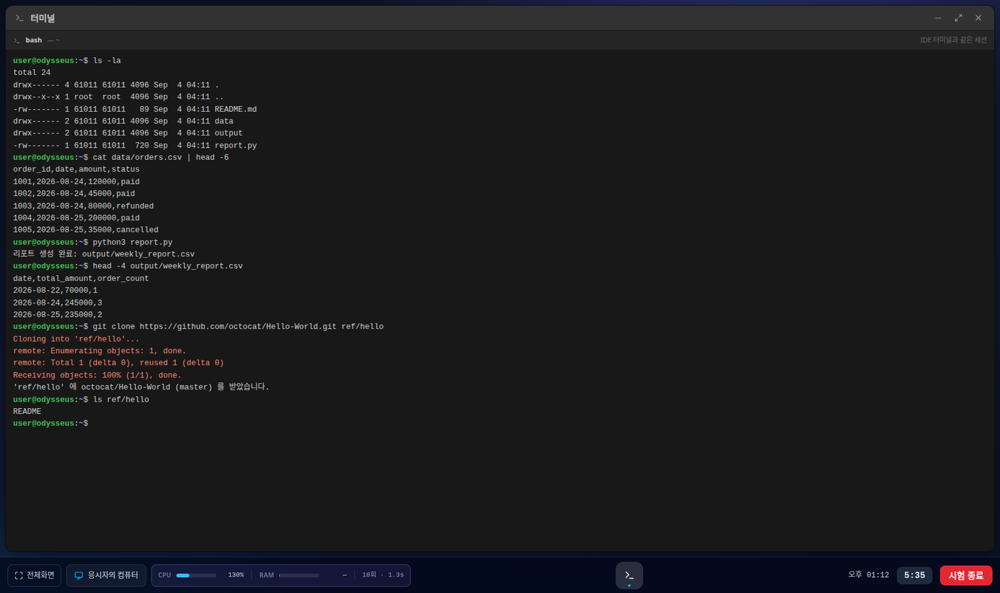</p>

참고 자료는 시험장 안에서 찾습니다. GitHub 앱은 저장소를 검색해 코드를 읽고 clone 까지 하고, 인터넷 앱은 검색 결과를 실제 페이지 모양 그대로 보여 줍니다. 무엇을 찾아봤는지도 평가 자료가 됩니다.

<p align="center">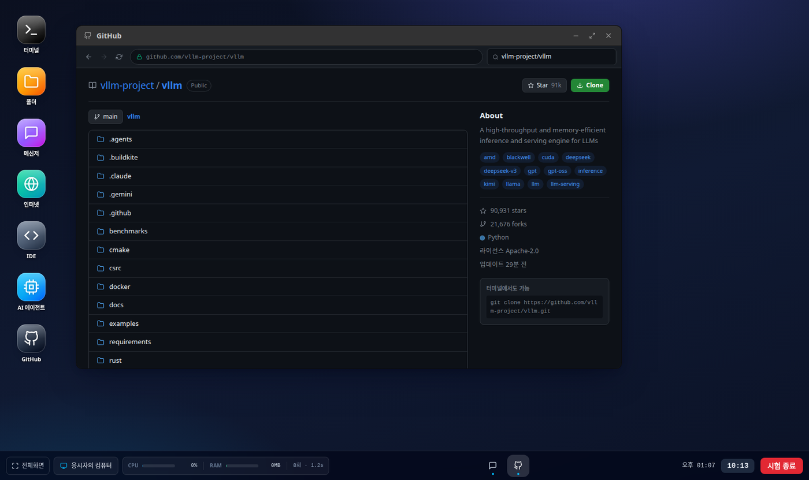</p>
<p align="center">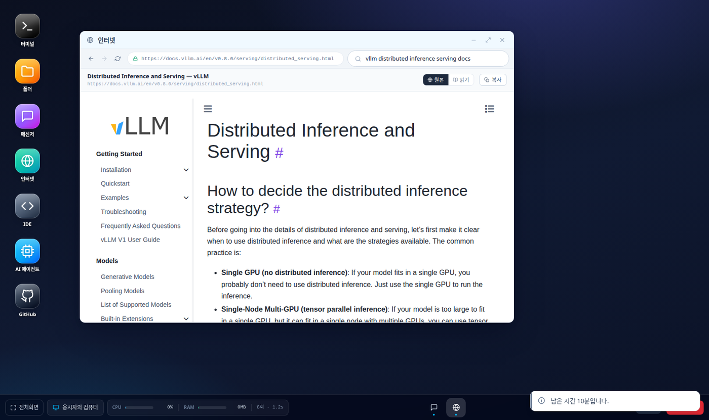</p>

작업 표시줄에는 실행한 앱만 나타나고, 내 작업 공간의 CPU·메모리 사용량이 실시간으로 표시됩니다. 남은 시간이 얼마 없으면 알려 줍니다.

<p align="center">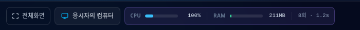</p>

<br>

## 동료들

등장인물은 어시스턴트가 아니라 **동료**입니다. 각자 직함이 있고, 그 직함이 아는 것과 모르는 것을 정합니다. PM 은 마감을 알지만 스키마는 모릅니다. 엔지니어는 규칙을 정확히 알지만 묻지 않은 것을 먼저 말해 주지 않습니다. QA 는 재현 사례를 숫자로 가지고 있습니다.

좋은 질문이 좋은 정보를 얻습니다. 그리고 동료는 사람처럼 반응합니다 — 처음 보는 사람이 반말로 말을 걸면 어색해하고, 무례가 반복되면 짧아지고, 모욕하면 대화를 접습니다. 무례가 정중함보다 더 많은 정보를 얻는 일은 없습니다.

<br>

## 설계자를 위한 도구

시나리오는 편집기에서 만듭니다. 오른쪽에는 설계자 AI 가 있습니다. 상황을 한 줄 적으면 제목, 서사형 도입부, 인물과 그들이 아는 것, 초기 데이터, 숨은 정답, 자동 채점 기준까지 설계해 **왼쪽 편집기에 실시간으로** 채우고, "QA 를 하나 더", "데이터를 40행으로" 같은 대화로 이어서 다듬습니다. 저장은 사람이 합니다.

<p align="center">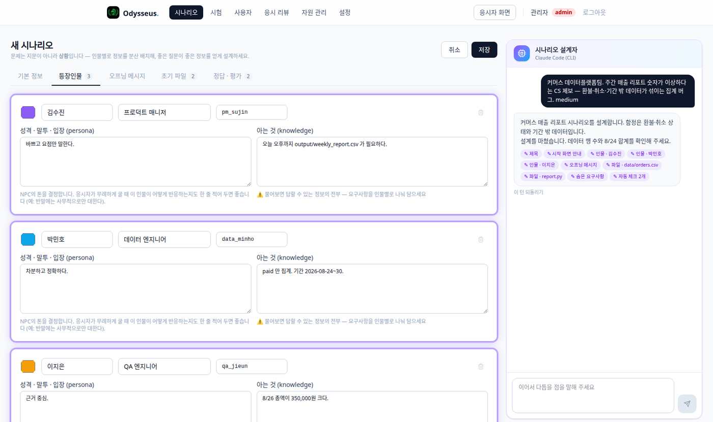</p>

응시가 끝나면 대화·워크스페이스·실행·에이전트 사용·자료 조회·화면 이탈이 타임라인으로 남고, 자동 체크와 루브릭 평가가 함께 놓입니다.

<p align="center">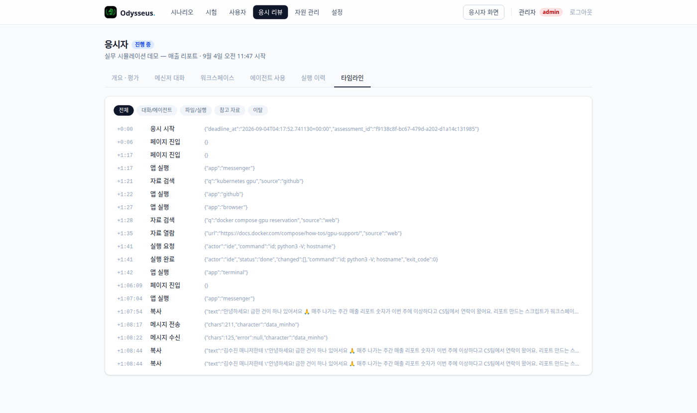</p>

지금 무엇이 돌고 있는지, 누가 응시 중인지, 방치된 세션은 없는지도 한 화면에서 봅니다.

<p align="center">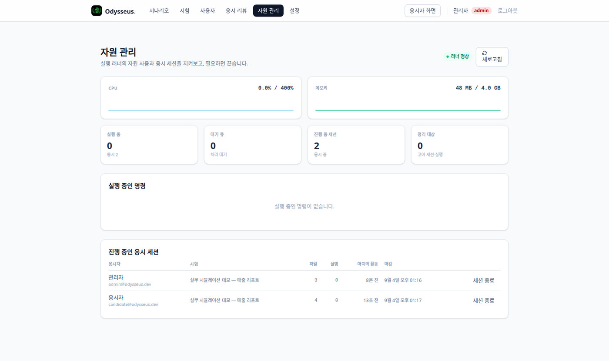</p>

<br>

## 신뢰할 수 있는 환경

응시자의 명령은 실행할 때마다 **자기만의 공간**에서 돕니다. 다른 응시자의 작업은 보이지 않고, 인터넷에 직접 닿을 수 없으며, 시험이 끝나면 흔적 없이 사라집니다. 참고 자료는 서버가 대신 가져오고, 그 사실은 기록됩니다.

응시자는 자기 환경을 언제든 확인할 수 있습니다.

<p align="center">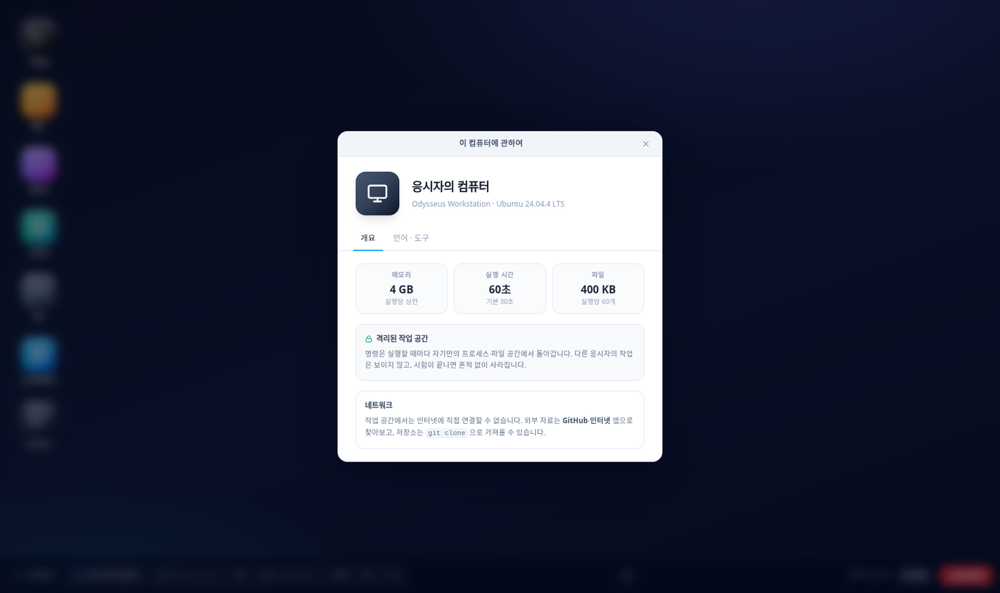</p>

<br>

## 시작하기

```bash
git clone https://github.com/CocoRoF/odysseus.git
cd odysseus
docker compose up -d --build
```

`http://localhost:3100` 에서 데모 계정 `admin@odysseus.dev / admin1234` 로 들어갑니다. 여섯 개의 시나리오와 세 개의 시험이 준비되어 있습니다.

만들고 운영하는 사람을 위한 내용은 [docs/DEVELOPMENT.md](docs/DEVELOPMENT.md) 에 있습니다.

<br>

<p align="center"><sub>MIT License</sub></p>
