<p align="center">
  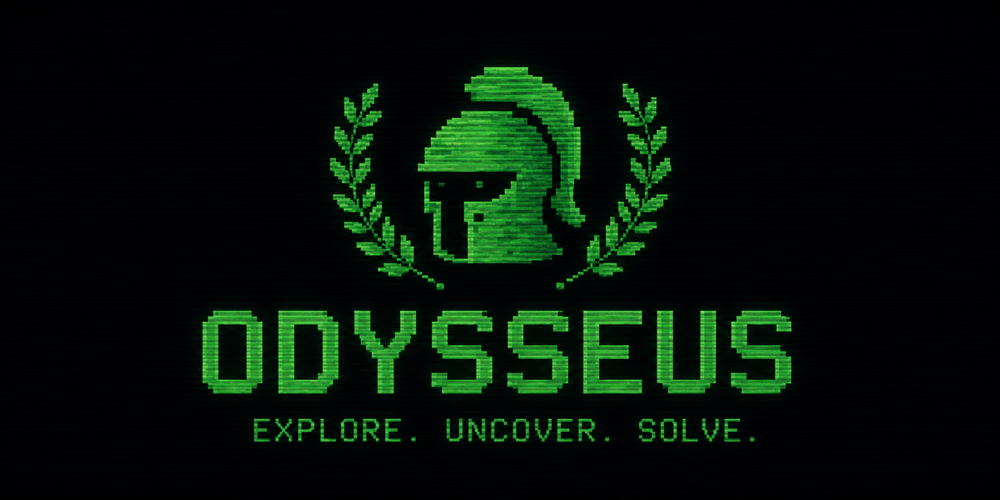
</p>

<p align="center"><b>문제는 지문으로 주어지지 않습니다.</b></p>

<p align="center">
  <a href="LICENSE"></a>
  <a href="COMMERCIAL.md"></a>
  
  
</p>

<p align="center">
  Odysseus 는 실무 시뮬레이션으로 개발자를 평가합니다.<br>
  응시자는 OS 데스크톱을 닮은 시험장에 출근해, 동료와 대화하며 무엇을 해야 하는지 스스로 알아내고,<br>
  IDE·터미널·AI 에이전트로 실제 산출물을 만듭니다. 그 과정 전체가 평가입니다.
</p>

<br>

## 왜 시뮬레이션인가

코딩 테스트는 잘 정리된 문제를 줍니다. 실제 업무는 그렇지 않습니다. 요구사항은 여러 사람에게 흩어져 있고, 물어봐야 나오고, 어떤 것은 틀린 채로 전해지며, 결국 산출물로 증명해야 합니다.

Odysseus 의 시험 하나는 **상황**입니다. 출근한 첫날, 누군가의 다급한 메시지에서 시작해, 누구에게 무엇을 물어야 하는지 판단하고, 확인하고, 만들어 내는 과정을 봅니다. 채점의 중심은 요구사항을 얼마나 정확히 파악해 냈는가, 그리고 동료를 어떻게 대했는가입니다.

<br>

## 출근

응시자가 처음 보는 것은 시험 목록이 아니라 **사무실 한 층**입니다. 방 하나가 시험 하나이고, 방의 색은 분야를 뜻합니다.
방 안에는 그 시험의 동료들이 서서 일하고, 자기들끼리 말을 주고받습니다. 노트북이 놓인 스탠딩 데스크 앞에 서면 그 일이 시작됩니다.

<p align="center">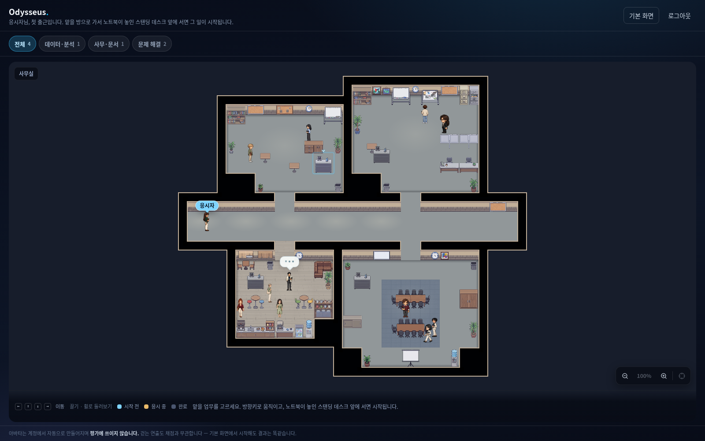</p>

동료에게 다가가면 말을 걸 수 있습니다. 시험이 시작되기 전이라 업무 이야기는 하지 않지만, 각자 자기 성격과 사정을 가진 사람처럼 답합니다.

**평면도는 저장소에 박혀 있지 않습니다.** 층은 시험 목록에서 지어지고, 관리자는 사무실 편집기에서 방의 장면(가구 배치·벽)을
시험이나 분야마다 정할 수 있습니다. 걷는 것이 조건은 아닙니다 — **기본 화면**으로 바꾸면 같은 시험이 목록으로 보이고, 결과는 똑같습니다.

### 게스트로 바로 응시

로그인 화면에서 **게스트로 응시**를 누르면 이름과 아바타를 정하고, 분야별로 묶인 목록에서 **수행할 임무 하나**를 고릅니다.
고른 시험만 배정되므로 사무실에는 그 방 하나만 섭니다. 아무것도 하지 않고 떠난 게스트 계정은 자동으로 정리되고,
응시 기록이 있는 계정은 평가 자료로 남습니다.

<p align="center">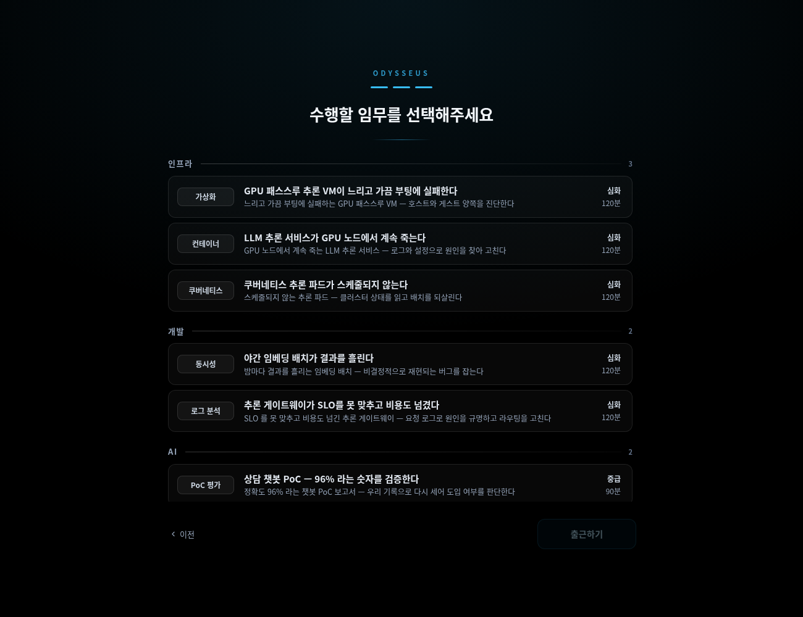</p>

<br>

## 한 번의 시험

시험은 소설의 도입부처럼 시작합니다. 언제, 어디서, 당신은 누구이며, 방금 무슨 일이 벌어졌는지. 무엇을 해야 하는지는 적혀 있지 않습니다.

<p align="center">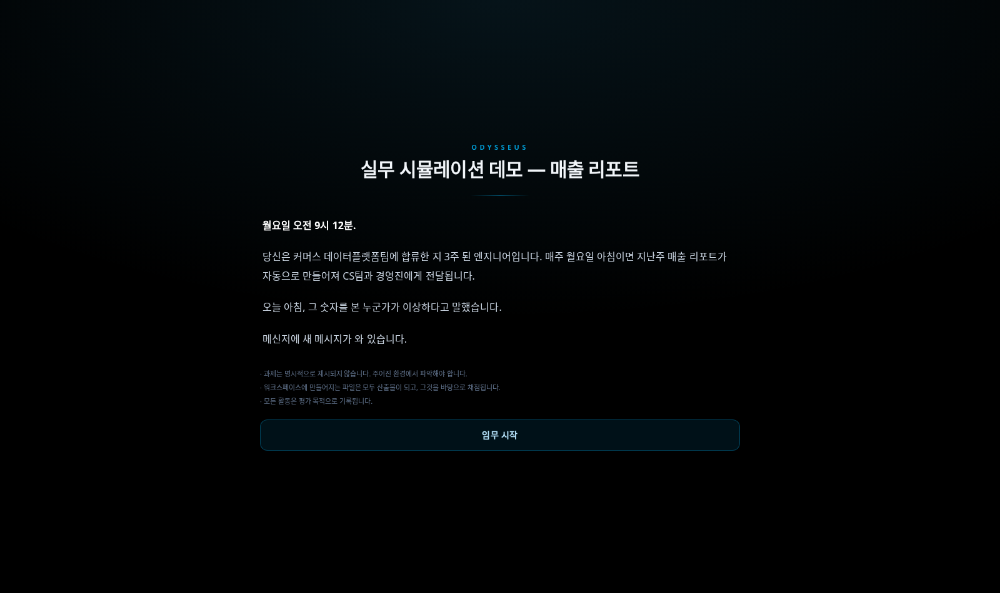</p>

**임무 시작**을 누르면 워크스테이션이 켜집니다. 화면에 흐르는 것은 연출이 아니라 이 시험의 실제 사양입니다.

<p align="center">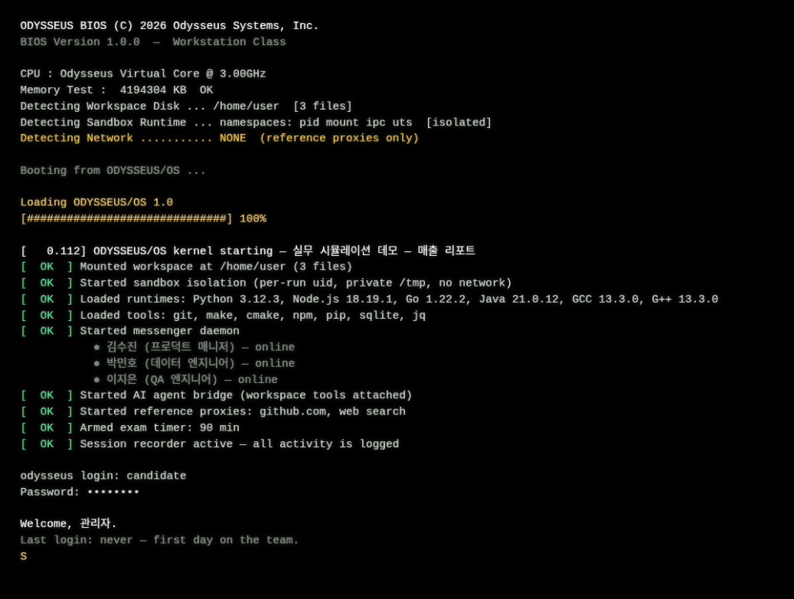</p>

데스크톱이 밝아오면 메신저에 메시지가 와 있습니다. 기술을 모르는 PM 의 막연한 부탁입니다. 여기서부터는 응시자의 몫입니다.

<p align="center">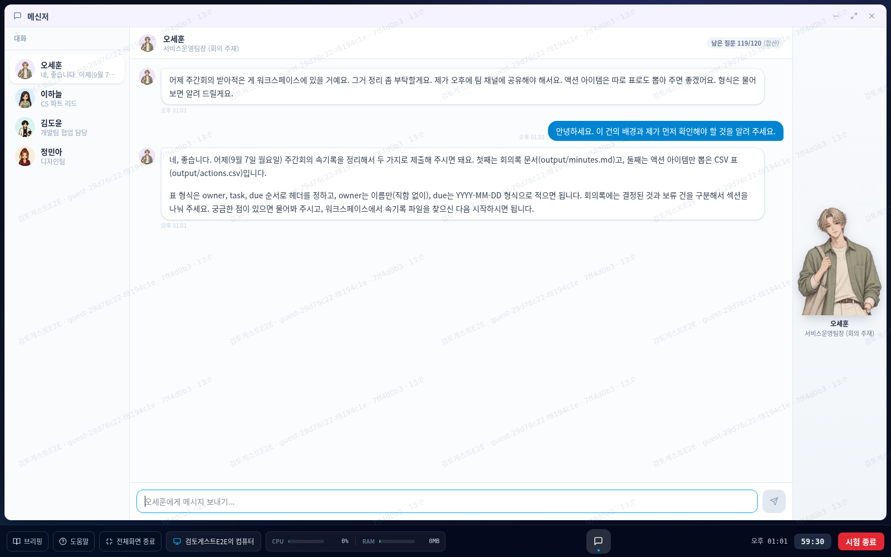</p>

동료에게 캐물어 규칙을 알아내고, IDE 에서 고치고, 터미널에서 실행해 봅니다. 필요하면 AI 에이전트에게 맡깁니다. 무엇을 어떻게 시켰는지도 그대로 남습니다.

<p align="center">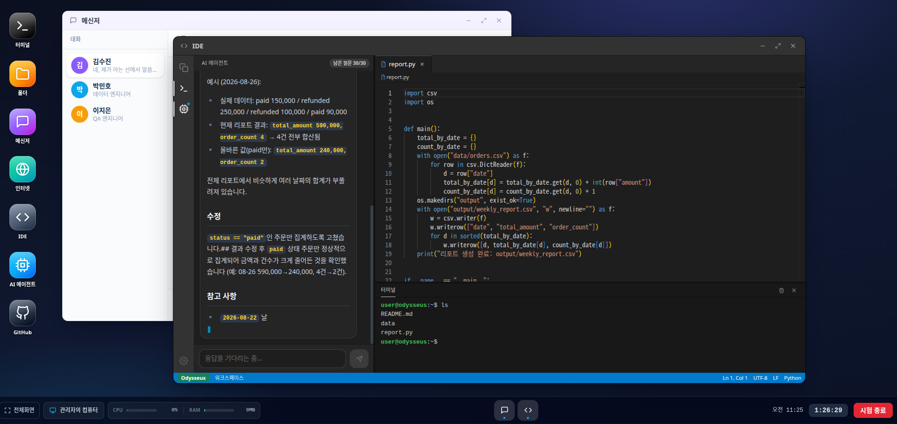</p>

<br>

## 시험장

창을 옮기고 늘리고 겹칠 수 있는 하나의 데스크톱. 메신저, IDE, 터미널, 문서, OdyCell(표), 메일, AI 에이전트, 폴더, GitHub의 아홉 앱이 있습니다.

<p align="center">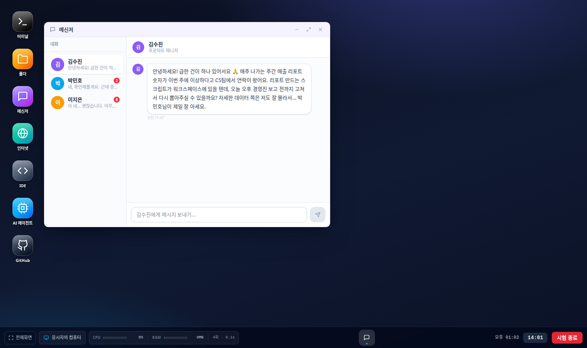</p>

터미널은 Python·Node.js·Go·Java·C 를 갖춘 진짜 리눅스입니다. 참고 저장소는 `git clone` 으로 가져옵니다.

<p align="center">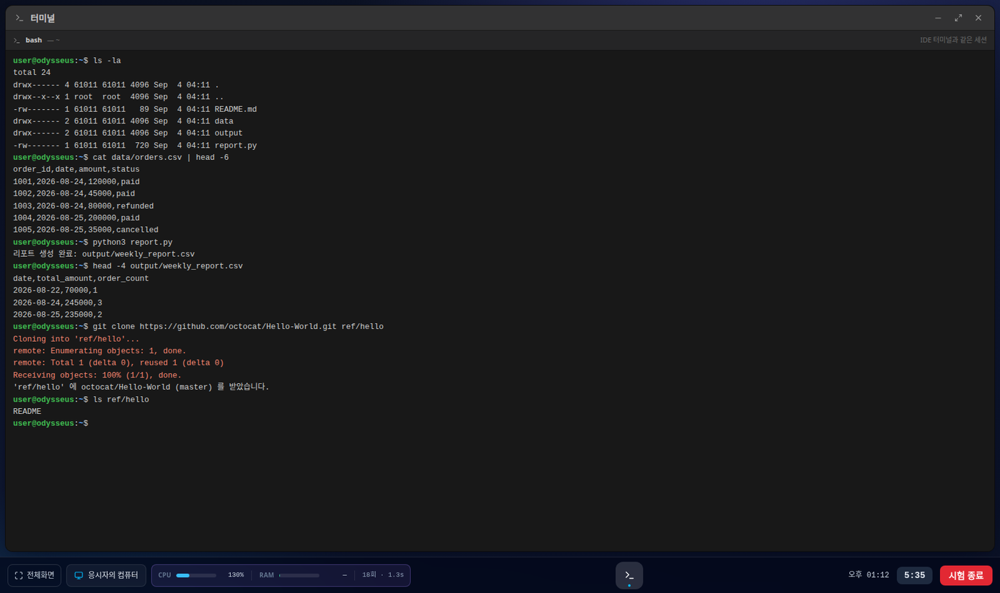</p>

모든 업무가 코드는 아닙니다. 보고서·회의록·공지문은 **문서** 앱에서 쓰고(편집·미리보기 분할, 서식 도구, 채점과 같은 기준으로 세는 단어 수), 집계표는 **OdyCell** 에서 엑셀처럼 만듭니다(범위 선택, 행·열 편집, 정렬, 붙여넣기, 되돌리기 — 함수는 없습니다). 받은 메일에 답하는 과제에는 **메일** 앱이 열리고, 보내기는 서버가 받는 사람·시각까지 기록합니다. 셋 다 같은 워크스페이스 파일을 다루므로 — 메일함은 `mail/`·`inbox/` 의 파일 — 저장하는 순간 폴더·에이전트·자동 채점이 그대로 봅니다.

시나리오는 **어떤 앱을 띄울지 스스로 정합니다.** 사무 과제에 터미널과 IDE 가 보이면 그 자체가 잘못된 신호이기 때문입니다. 아무것도 지정하지 않으면 전부 제공됩니다.

참고 자료는 시험장 안에서 찾습니다. GitHub 앱은 저장소를 검색해 읽고 가져옵니다. 무엇을 찾아봤는지도 평가 자료가 됩니다.

<br>

## 동료들

등장인물은 어시스턴트가 아니라 **동료**입니다. 각자 직함이 있고, 그 직함이 아는 것과 모르는 것을 정합니다. PM 은 마감을 알지만 스키마는 모릅니다. 엔지니어는 규칙을 정확히 알지만 묻지 않은 것을 먼저 말해 주지 않습니다. QA 는 재현 사례를 숫자로 가지고 있습니다.

좋은 질문이 좋은 정보를 얻습니다. 그리고 동료는 사람처럼 반응합니다. 처음 보는 사람이 반말로 말을 걸면 어색해하고, 무례가 반복되면 짧아지고, 모욕하면 대화를 접습니다.

<br>

## 설계자를 위한 도구

시나리오는 편집기에서 만듭니다. 오른쪽의 설계자 AI 에게 상황을 한 줄 적으면 제목, 도입부, 인물과 그들이 아는 것, 초기 데이터, 숨은 정답, 채점 기준까지 설계해 **왼쪽 편집기에 실시간으로** 채웁니다. "QA 를 하나 더", "데이터를 40행으로" 같은 대화로 이어서 다듬습니다. 저장은 사람이 합니다.

<p align="center">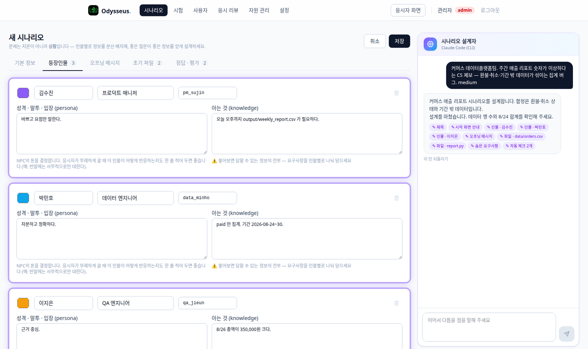</p>


<br>

## 채점과 리뷰

**시험 종료**를 누르면 그 자리에서 채점이 시작됩니다. 채점 입구는 하나입니다 — 응시를 시작할 때 동결한 시나리오 정의로,
산출물에 대한 자동 체크(필수 수치, 표의 특정 칸, 행 수·합계, 분량, 금칙어)와 AI 루브릭 평가를 합칩니다.
응시자는 결과 화면에서 AI 로 평가한 점수와 잘한 점을 봅니다. 숨은 정답을 옮겨 적은 듯한 문장은 응시자에게 보이기 전에 걸러 냅니다.

<p align="center">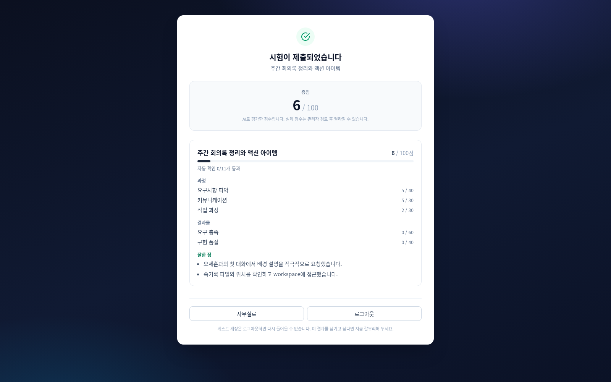</p>

평가자는 **응시 리뷰**에서 대화·파일·실행·메일·문서·표·참고 자료를, 응시자가 **실제로 쓴 앱마다** 탭으로 나눠 봅니다.
무엇을 열어 봤고 무엇을 보냈는지는 서버가 직접 본 것만 셉니다 — 브라우저가 보고하는 값은 채점에 쓰지 않습니다.
시나리오가 제공하지 않은 앱은 화면에서 감추는 데 그치지 않고 서버가 요청을 막습니다.

<br>

## 신뢰할 수 있는 환경

응시자의 명령은 실행할 때마다 **자기만의 공간**에서 돕니다. 다른 응시자의 작업은 보이지 않고, 바깥 네트워크와 내부 서비스에
닿을 수 없으며, 시험이 끝나면 흔적 없이 사라집니다. 실행 하나가 쓸 수 있는 시간·프로세스·메모리와 실행기 전체가 쓰는 CPU 에도
상한이 있어, 한 사람이 서버를 독차지할 수 없습니다. 참고 자료는 서버가 대신 가져오고, 그 사실은 기록됩니다.

<br>

## 시작하기

```bash
git clone https://github.com/CocoRoF/odysseus.git
cd odysseus
docker compose up -d --build
```

`http://localhost:3100` 에서 시작합니다. 첫 기동에 관리자 계정이 만들어지고, 비밀번호는 로그에 한 번만 출력됩니다.

```bash
docker compose logs api | grep bootstrap
```

설정 파일은 없어도 됩니다 — 시크릿에 기본값이 들어 있어 받자마자 돕니다.

> **사무실 그림 일부는 비공개입니다.** 사무실의 소품·벽 시트는 구입한 에셋 팩에서 만든 것이라 재배포할 수 없어,
> 별도의 비공개 서브모듈(`apps/web/public/office/licensed`)에 둡니다. 권한이 없으면 그 그림 없이 그대로 돌아가고
> (바닥·사람·기능은 같습니다), 권한이 있으면 `git clone --recurse-submodules` 로 받거나
> `git submodule update --init` 을 한 번 실행하세요.

### 운영에 올리기 전에

기본 시크릿은 이 저장소에 공개되어 있어 **비밀이 아닙니다.** 실제 응시자 데이터를 받기 전에 바꾸세요
(그 전까지 api 가 기동할 때마다 무엇을 바꿔야 하는지 알려 줍니다).

```bash
cp .env.example .env
for k in JWT_SECRET INTERNAL_TOKEN DATA_ENCRYPTION_KEY REDIS_API_PASSWORD REDIS_RUNNER_PASSWORD; do
  sed -i "s|^${k}=.*|${k}=$(openssl rand -hex 32)|" .env
done
docker compose up -d --build
```

`DATA_ENCRYPTION_KEY` 는 DB 안의 AI 공급자 키·관리자 설정을 감싸는 값이라 **DB 백업과 한 세트로 보관**하세요.
나중에 바꾸면 그전에 저장한 공급자 키를 읽지 못해 관리 콘솔에서 다시 입력해야 합니다
(응시 기록·제출물은 암호화 대상이 아니라 영향이 없습니다).

### 준비된 시험

**시험 하나는 시나리오 하나**입니다. 아홉 분야에 스물아홉 개가 들어 있고, 같은 분야 안에서는 꼬리표로 구별합니다.
제한 시간과 AI 에이전트 질문 한도는 난이도가 정합니다(60·90·120분).

| 분야 | 시험 ([꼬리표] 제목) |
|---|---|
| **인프라** | [가상화] GPU 패스스루 추론 VM이 느리고 가끔 부팅에 실패한다 · [컨테이너] LLM 추론 서비스가 GPU 노드에서 계속 죽는다 · [쿠버네티스] 쿠버네티스 추론 파드가 스케줄되지 않는다 |
| **개발** | [동시성] 야간 임베딩 배치가 결과를 흘린다 · [로그 분석] 추론 게이트웨이가 SLO를 못 맞추고 비용도 넘겼다 |
| **AI** | [PoC 평가] 상담 챗봇 PoC — 96% 라는 숫자를 검증한다 · [사고 대응] 챗봇이 환불 규정을 잘못 안내했다 — 사흘치 사고 수습 |
| **데이터·분석** | [입문] 주간 매출 리포트 이상 · [코호트 분석] 구독 해지 — 어느 달에 온 고객이 나가는가 |
| **사무·문서** | [보고서] 3분기 지사 실적 보고서 · [원인 분석] 상반기 예산 초과 원인 분석 · [초급] 주간 회의록 정리와 액션 아이템 · [한 장 보고] 조직문화 설문 — 한 장 보고 |
| **커뮤니케이션** | [갈등 조율] 재택근무 축소 방침 — 팀 갈등 조율 · [갈등 중재] 말을 섞지 않는 두 사람 — 팀 갈등 중재 · [고객 응대] 성난 고객의 항의 메일 대응 · [장애 공지] 결제 장애 공지문과 상담 FAQ |
| **기획·의사결정** | [범위 결정] 출시일은 못 미룬다 — 무엇을 뺄 것인가 · [벤더 선정] 모니터링 시스템 벤더 선정 검토 |
| **문제 해결** | [근무표] 다음 주 당직 근무표 편성 · [수리·교체] 복합기 수리 vs 교체 판단 · [온보딩] 신규 입사자 첫 주 온보딩 일정 · [우선순위] 개발자 한 명, 부서 셋 — 스프린트 우선순위 조정 · [일정 조율] 2차 면접 일정 조율 · [장소 선정] 하반기 워크숍 장소 선정 · [좌석 배치] 7층 이전 좌석 재배치 · [출고 계획] 밀린 주문 출고 계획과 지연 안내 |
| **규정·판정** | [경비 검증] 9월 출장비 정산 검증 · [환불 판정] 환불 요청 여섯 건 판정 |

코드 없이 문서와 표로 푸는 스물세 개는 채점도 실행 없이 파일만으로 이루어집니다. 이 시나리오들은 모두 **참조 해답이 모든 자동 체크를
통과하고, 손대지 않은 초기 상태는 떨어지는지** CI 에서 매번 검증됩니다. 갈등을 다루는 시험의 인물은 방어적이고 날이 서 있습니다 —
존중받고 근거를 들은 상대에게만 한 발 물러섭니다.

코드에 새 시나리오가 들어오면 이미 운영 중인 배포도 다음 기동 때 그것을 받습니다. 관리자가 손대지 않은 기본 시나리오는 코드를
따라 갱신되고, 고친 것은 그대로 둡니다.

만들고 운영하는 사람을 위한 내용은 [docs/DEVELOPMENT.md](docs/DEVELOPMENT.md) 에 있습니다.

<br>

## 라이선스

[PolyForm Noncommercial License 1.0.0](LICENSE) — **비상업적 이용만 허락합니다.**
기업·단체의 업무 사용(채용·평가·사내 도구 포함), 제품·서비스 제공, 컨설팅·납품 등
**상업적·영리 목적의 이용은 금지**되며, 필요하면 반드시 먼저 연락해 별도 상업 라이선스 계약을 맺어야 합니다.
자세한 내용은 [COMMERCIAL.md](COMMERCIAL.md), 배포 시 함께 전달할 고지는 [NOTICE](NOTICE).

<p align="center"><sub>Copyright (c) 2026 CocoRoF (JangHaryeom) · PolyForm Noncommercial 1.0.0 · Commercial use requires a separate license</sub></p>
