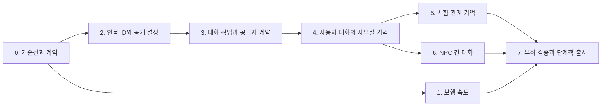

# NPC 시스템 구현 계획

작성: 2026-09-15 · 기준 commit: `fc2c576` · 최초 구현 계획

실제 구현과 검증 범위, 공급자 상태는 [구현·운영 문서](NPC-OPERATIONS.md)에 기록한다.

설계와 연구 근거는 [NPC 시스템 설계](NPC-SYSTEM-DESIGN.md)를 따른다.
사용자별 독립 사무실, 사무실 대화 전체 보존, 시험으로는 제한된 관계 기억만 전달한다는 범위는 사용자 답변으로 확정됐다.

## 1. 작업 순서

속도 변경은 독립적으로 완료할 수 있다. 지속 기억과 대화는 정보 경계와 인물 식별을 먼저 갖춘 뒤 연결한다.
아래 PR 표기는 작업 단위 제안이며 실제 GitHub PR 번호가 아니다.



“일반화”의 완료 조건은 새 시나리오와 인물을 추가할 때 인물별 Python/TypeScript 분기 없이 공개 설정·배역·활동 데이터만 작성하면 동작하는 것이다.
일반 상태 enum, 속도·예산·cooldown 같은 수치 설정은 허용한다. 이름이나 문제 분야를 검사하는 대사/권한 분기는 허용하지 않는다.

## 2. 단계별 변경과 완료 조건

### 0. 기준선·계약·평가 fixture

작업:

- 현재 인물 키 충돌, 명단 선택, 등장인물 수, 공개 필드 상태를 읽기 전용으로 집계한다.
- `npc_id`·배역·세계·공개 revision·관계 bridge·모드별 접근 규칙을 스키마 계약으로 확정한다.
- 대표 시나리오와 사용하지 않은 평가 시나리오를 분리한다. 비공개 canary, 같은 이름의 다른 인물, 인사·정정·재접속 사례를 포함한다.
- 공급자별 JSON, 토큰 제한, usage, 취소, 역할 보존, 첫 응답·완료 시간의 측정기를 마련한다.
- 관측에는 raw 비밀이나 사용자 대화 원문 대신 job ID, revision, 지연, token 수, 실패 분류를 기본으로 남긴다.
- 대상 동시 접속량·호출 예산·기억 보존 설정을 기록한다. 측정 전 생산 성능을 약속하지 않는다.

완료 조건: 데이터 이동 권한표와 fixture가 모순 없고, 운영 자격증명 없이 재현 가능한 기준선 보고서가 있다.
실제 모델 실험은 테스트 세계와 별도 예산으로 수행한다. 운영 사용자 대화를 실험 데이터로 자동 전용하지 않는다.

### 1. NPC 보행 속도 1.3배

주요 파일: [`useCrew.ts`](../apps/web/components/office/useCrew.ts), [`OfficeStage.tsx`](../apps/web/components/office/OfficeStage.tsx).

작업:

- 공통 motion 설정으로 보행 속도 `52 → 67.6` 월드 px/초 적용.
- 보폭과 프레임 주기 동기화. 경로 종료·저프레임의 큰 시간 차이에서 overshoot 방지.
- 향후 대화 상대별 예약에 필요한 이동 상태 인터페이스를 검토하되 속도 변경 PR에 대화 기능을 섞지 않는다.

완료 조건: 동일 경로·시간에서 이동 거리가 1.3배이고 가구 우회·정지·사용자 근접 반응이 유지된다.
검증: 기존 경로 테스트, 대표 사무실 실제 보행 확인. 수치 상수를 그대로 반복하는 형식적 테스트는 추가하지 않는다.

### 2. 인물 ID·공개 시나리오 설정·버전

주요 파일:

- [`models.py`](../apps/api/odysseus_api/models.py), [`schemas.py`](../apps/api/odysseus_api/schemas.py), [`migrations.py`](../apps/api/odysseus_api/migrations.py).
- [`office.py`](../apps/api/odysseus_api/office.py), [`routers/attempts.py`](../apps/api/odysseus_api/routers/attempts.py), [`routers/scenarios.py`](../apps/api/odysseus_api/routers/scenarios.py).
- [`definitions.py`](../apps/api/odysseus_api/definitions.py), [`types.ts`](../apps/web/lib/types.ts), 시나리오 작성 UI 및 생성 스키마.

작업:

- canonical 인물과 시나리오 배역을 명시적으로 연결. 기존 `key`를 동명이인 병합에 사용하지 않음.
- 공개 배경·말투·사실·활동·주제 데이터와 발행 revision 도입.
- 공개 projection의 출제 데이터 역참조는 서버 내부에서만 관리. 클라이언트 DTO는 필요한 최소 필드만 반환.
- 공개 입력 타입과 시험 입력 타입을 분리. 사무실 repository/worker에서 비공개 출제 필드 접근을 제한.
- 기존 명단의 여섯 명 제한과 외형 배정 정책을 유지하면서 ID 충돌을 진단. 동일 인물의 명시적 연결을 지원.
- 공개 자료가 없는 기존 시나리오는 최소 인사로 동작. 기존 자유문을 자동으로 공개 승인하지 않음.
- 기존 definition v3 읽기를 보존하고 새 정의 버전에 필요한 ID·공개 revision·prompt policy version을 추가.

완료 조건: 새 인물을 데이터만으로 추가할 수 있고, 동일 key의 다른 인물이 같은 기억 키를 갖지 않는다.
검증: [`test_office_roster.py`](../tests/unit/test_office_roster.py)의 비공개 필드 제외 의도를 유지하면서 새 allowlist를 검증한다.
비공개 값만 바꿔도 사무실 context가 달라지지 않는 테스트와 기존 정의를 읽는 호환 테스트를 추가한다.

### 3. 복구 가능한 대화 작업·공급자 계약

주요 파일: 모델·마이그레이션, [`provider.py`](../apps/api/odysseus_api/ai/provider.py), [`main.py`](../apps/api/odysseus_api/main.py), compose/배포 설정.
새 모듈 제안: `npc/context.py`, `npc/policy.py`, `npc/jobs.py`, 별도 AI worker 진입점. 경로명은 구현 시 확정한다.

작업:

- 대화·참여자·사건·작업/outbox 저장 구조 및 요청 ID 고유 제약 도입.
- 작업 상태 `queued / running / succeeded / failed / cancelled / expired`와 lease 세대, 재시도 정책 구현.
- 짧은 DB transaction과 DB 외부 LLM 호출 분리. 오래된 worker의 commit 차단.
- 호출별 예산·deadline·취소·usage를 공통 공급자 계약으로 정리. CLI `max_tokens` 누락 경로 처리.
- 사용자·세계·공급자·전체 동시성 한도와 시험 처리 용량 보호.
- Redis 장애에도 DB 작업·완료 결과가 남도록 구현. 복구를 무감독 API 내 무한 LLM 루프에 맡기지 않음.
- office worker의 읽기 범위를 공개 설정·허용된 사무실 데이터로 제한하고 시험용 도구를 제공하지 않음.

완료 조건: 중복 POST, worker 종료 후 재시도, lease 만료, Redis 장애에서 사용자 메시지와 답변 효과가 중복되지 않는다.
검증: fake provider와 실제 PostgreSQL/Redis를 이용한 통합 테스트. 프로세스 내부 mock만으로 여러 worker의 동시성을 검증했다고 하지 않는다.
이 단계의 도입으로 기존 시험 요청의 공급자나 prompt 동작이 바뀌어서는 안 된다.

### 4. 사용자–NPC 사무실 대화·시나리오 인사·기억

주요 파일: [`routers/office.py`](../apps/api/odysseus_api/routers/office.py) 또는 전용 router, [`TalkBox.tsx`](../apps/web/components/office/TalkBox.tsx), [`OfficeStage.tsx`](../apps/web/components/office/OfficeStage.tsx), [`api.ts`](../apps/web/lib/api.ts).
새 모듈 제안: `npc/memory.py`, `npc/prompts.py`, `npc/validation.py`, office event stream hook.

작업:

- 대화 생성/재개·메시지 접수·페이지 조회·SSE API 및 owner/world/actor 권한 검사.
- 서버가 선택한 office 모드, 공개 인물 설정, 출처가 있는 관련 기억으로 프롬프트 조립.
- 공개 인사 후보 사전 생성·검증과 실제 만남 상태에 따른 선택. 입력창으로 사용자가 자유롭게 말 걸기.
- 원본 사건과 관계 기억의 일관된 저장. 개인 대화와 공개 사건 scope 분리.
- 검증된 답변만 화면에 전달. 실패 상태·재시도·대기·취소·재접속·한글 IME 지원.
- 선택한 NPC만 정지하고 주변 NPC는 이동. 키 입력이 이동/대화 종료로 잘못 전파되지 않도록 처리.
- 같은 사용자의 여러 탭·방 전환·세계 revision 변경에서 대화와 화면 상대가 일치하도록 처리.

완료 조건: 처음 인사 → 대화 → 새로고침 → 재회가 이어지고, 다른 사용자/다른 NPC의 개인 이야기를 회상하지 않는다.
검증: API 권한·출력 범위·기억 출처 검사와 브라우저 E2E. 사용자 질문을 정답 확인 oracle로 악용하는 다중 턴 공격도 포함한다.
최소 공개 데이터에서도 중립적으로 동작하며, 풍부한 공개 데이터에서는 인물 말투와 장면이 구분되는지 사람이 평가한다.

### 5. 시험으로의 관계 기억 전달

주요 파일: [`routers/attempts.py`](../apps/api/odysseus_api/routers/attempts.py)의 시작·재응시, [`definitions.py`](../apps/api/odysseus_api/definitions.py), [`npc.py`](../apps/api/odysseus_api/ai/npc.py), [`npc_prompt.py`](../apps/api/odysseus_api/ai/npc_prompt.py), [`messenger.py`](../apps/api/odysseus_api/routers/messenger.py).

작업:

- 시작 transaction의 사건 cutoff와 ID 대응을 기준으로 구조화 bridge 고정.
- 관계 갱신을 비동기 요약 완료 여부와 분리. 시작 직전 완료된 인사를 놓치지 않도록 함.
- 임의 대화 요약·NPC 간 대화·친밀도·태도 누적치를 bridge 스키마에서 거부.
- 기존 시험 renderer에 social/task adapter 추가. 관계 bridge는 재회 표현 경로에만 사용하고 문제 답변 입력에서는 제외.
- social 표현과 task 답변을 구분해 기록. 사무실 유래 표현이 후속 문제 답변 context나 평가 입력으로 다시 들어가지 않도록 처리.
- 새 prompt policy 버전을 새 응시 정의에 고정. legacy policy가 필요한 진행 중 응시는 기존 동작을 유지.
- 기존 오프닝 메시지와 첫 응답의 인사가 중복되지 않도록 처리.

완료 조건: 사무실에서 만난 해당 NPC가 시험에서 재회를 인식하고, 문제 정보·정답 제공 조건·평가에는 차이가 없다.
검증: 인사 commit과 시험 시작 경합, 응답 지연, 재응시, revision/인물 불일치, 과거 snapshot 호환.
문제 답변·평가 입력이 동일하고 social 출력만 달라지는지 검사한다. 실제 모델의 paired 평가로 행동 차이도 확인한다.

### 6. NPC 간 짧은 대화와 공개 기억

주요 파일: 공통 NPC 모듈, [`useCrew.ts`](../apps/web/components/office/useCrew.ts), [`OfficeCanvas.tsx`](../apps/web/components/office/OfficeCanvas.tsx), [`OfficeStage.tsx`](../apps/web/components/office/OfficeStage.tsx), 장면 anchor 계약.

작업:

- 같은 세계·시험 방의 활성 참여자, 공개 주제, cooldown, 활동 상태에서 트리거 선택.
- 단일 탭 제어 lease, 서버의 참여자 예약·활동 계획, 클라이언트의 경로 이동·도달 확인 연결.
- 공통 공개 context만으로 2인 2–4발화 초안 생성, 발화자·참조·문장 검증.
- 실제 발화 sequence와 사건 기록 결합. 발화된 부분만 기억하고 취소된 나머지는 제외.
- 사용자 말 걸기 우선, 말풍선 위치·읽는 시간·시선·선택한 NPC의 응답 연결.
- 관찰자와 참여자의 공개 범위별 기억 생성. 개인 사용자 대화는 잡담 입력에서 제외.
- 잡담 연쇄 깊이·반복 주제·동시 장면·활성 세계의 호출량 제한.

완료 조건: NPC들이 화면에서 만난 뒤 발화하고, 사용자 개입·경로 실패·탭 전환·늦은 응답에도 상태와 기억이 어긋나지 않는다.
검증: 복수 NPC 예약 경합과 세대 변경, 두 문장 후 중단, 마지막 연결 해제, 관찰하지 않은 NPC의 회상 금지.
사용자가 없는 시간에도 LLM 호출이 계속 발생하는 구조는 출시하지 않는다. 이미 저장된 기억은 유지한다.

### 7. 품질·부하 검증과 단계적 출시

작업:

- 20/100/500 활성 세계의 fake-provider 부하와 장애 테스트. 실제 모델은 별도 제한된 예산으로 검증.
- 공급자별 queue wait·검증 포함 응답 지연·timeout·재시도·token 사용량·캐시 효과 수집.
- 기억 회수·정정·시간 관계·모를 때 응답, 시나리오 holdout, 인물 일관성, 반복률 평가.
- 여러 턴을 합쳤을 때의 단서 노출, 사용자 간 격리, 개인 기억의 잡담 유출, 시험의 관계 효과를 회귀군에 포함.
- 모드별 flag로 제한된 테스트 계정부터 켜고, 사용자 대화를 먼저 안정화한 뒤 잡담의 세계당 빈도를 확대.
- 새 테이블의 백업·복원과 배포 전후 보존 검증, 운영 관측·알림·취소 도구 마련.

완료 조건: 지원하는 공급자·동시 접속 범위·예산·측정된 지연을 명시할 수 있고, 정보 경계·복구 회귀 테스트가 통과한다.
모델/prompt를 바꿀 때에는 같은 평가군을 다시 실행한다. 단순 문서 수정에 이 전체 평가를 반복하지 않는다.

## 3. 기존 테스트와 추가 검증의 연결

| 기존 기반 | 유지할 의미 | 추가할 검증 |
|---|---|---|
| [`test_office_roster.py`](../tests/unit/test_office_roster.py) | 사무실 DTO에 persona/knowledge 미노출 | ID 충돌·공개 revision·projection 입력 불변성 |
| [`test_npc_guard.py`](../tests/unit/test_npc_guard.py) | 시스템 규칙/정답 문자열 유출 방어 | 모드별 입력 분리·기억 속 지시·다중 턴 단서 |
| [`test_reliability_core.py`](../tests/unit/test_reliability_core.py) | frozen 정의·기존 실행 신뢰성 | bridge cutoff·legacy 호환·작업 세대·idempotency |
| [`test_office_presets.py`](../tests/unit/test_office_presets.py), [`floorplan.test.ts`](../apps/web/components/office/floorplan.test.ts) | 장면·도달 가능한 경로 | 만남 anchor·대화 예약 중 경로 실패 |
| [`test_character_presentation.py`](../tests/unit/test_character_presentation.py), [`test_avatar_alloc.py`](../tests/unit/test_avatar_alloc.py) | 인물 표현·외형 일관성 | canonical ID 도입 후 명단과 초상화 일치 |
| 웹 typecheck·build | 데이터 계약·화면 빌드 | chat 상태·IME·SSE 재연결·동일 세계 다중 탭 E2E |

기존 CI 환경은 [`.github/workflows/ci.yml`](../.github/workflows/ci.yml)이 정본이다. Python 3.12와 Node 26을 사용한다.
아래는 구현 후 관련 단계에서 실행할 기존 검사이며, 이번 문서 작성에서 실행했다는 뜻이 아니다.

```bash
# 저장소 루트: CI의 잠금 의존성과 개발용 환경 설정을 사용
python -m compileall -q apps/api/odysseus_api apps/runner tests
PYTHONPATH=apps/api ODYSSEUS_ENV=development python -m unittest discover -s tests/unit -p 'test_*.py' -v

# apps/web 디렉터리: 잠금 의존성 설치 후
npx tsc --noEmit
node --test components/office/
node --test ../../tools/tileset/
npm run build
```

신규 worker/DB/E2E 검사는 별도 CI 작업으로 추가한다. 단위 테스트 통과가 실제 동시성·모델 품질을 대신하지 않는다.

## 4. 배포·롤백·데이터 보존

- 마이그레이션은 기존 [`migrations.py`](../apps/api/odysseus_api/migrations.py)의 순서와 잠금 규칙을 따른 additive 변경으로 시작한다.
- 새 schema → 호환 API/worker → 호환 웹 → 테스트 세계 flag 활성화 순으로 배포한다.
- 제안 flag는 `office_dialogue_enabled`, `office_ambient_enabled`, `office_exam_bridge_enabled`다. flag는 서버가 관리하고 오래된 클라이언트가 접근 범위를 넓힐 수 없게 한다.
- 문제 시 잡담·생성을 중지하고 기존 사무실 표시로 돌아간다. 대화 테이블을 삭제하거나 완료 기록을 되돌리지 않는다.
- bridge rollback은 새 응시에서 비활성화한다. 진행 중 응시의 고정 snapshot이나 정책을 임의로 바꾸지 않는다.
- [`backup.sh`](../scripts/backup.sh)는 DB dump를 사용하므로 신규 테이블도 복원 실험에 포함한다. 운영용 권한 분리 설정도 함께 복원 가능한지 확인한다.
- [`snapshot.py`](../scripts/snapshot.py)와 필요한 관리자 집계 경로에 세계·대화·사건·기억의 보존 확인을 추가한다. 정상적인 동시 쓰기·설정된 보존 만료와 데이터 유실을 구분한다.
- [`deploy.sh`](../scripts/deploy.sh)의 기존 백업·헬스·보존 확인 흐름에 worker readiness와 schema 호환을 포함한다.

이번 산출물은 설계와 실행 계획이다. 운영 배포는 구현 단계의 검증된 변경을 대상으로 수행한다.

## 5. 예상되는 어려움과 해결 기준

| 불확실성 | 해결 방법 | 완료 증거 |
|---|---|---|
| 오래된 인물 키가 같은 사람인지 | 명시적 ID 이행과 충돌 진단, 이름 기반 자동 병합 금지 | 이행 전후 인물/배역 대응 보고서 |
| 공개 배경이 빈약하거나 단서를 포함함 | 공개 필드 작성·발행과 안전한 최소 fallback | 출제 미리보기 및 holdout 평가 |
| 개인화가 시험 협조성을 바꿈 | bridge 필드 제한과 context 불변 검사, paired 모델 실험 | 관계 인사 외 조건/평가 차이 회귀 결과 |
| 모델이 사용자 질문에서 답을 추측함 | 공개 범위 제한, 진위 확인 금지, 다중 턴 출력 평가 | 실패 사례를 포함한 공격 평가 보고서 |
| 공급자 latency/토큰 제한 편차 | capability 측정, 모드별 예산, 예약된 처리 용량 | 공급자별 지연·usage·취소 테스트 |
| 화면과 서버의 만남 시각 불일치 | 서버 활동 예약 + anchor 이동 확인 + 만료/취소 | 탭·경로 실패·늦은 결과 E2E |
| 기억 요약의 왜곡·무한 증가 | 원본 출처, 수정 이력, 범위별 회수, 보존 정책 | 장기 대화 회상·삭제·재구성 테스트 |

검증되지 않은 개발 일정이나 비용을 고정하지 않는다. 먼저 0단계에서 기준선을 얻고 각 작업의 실제 범위를 산정한다.
